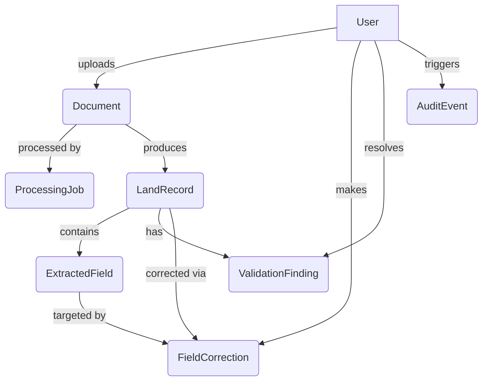

# Backend 1: Domain Model

## Overview
This phase introduces the persistent domain model and database layer for the Bhu-Lekh Land Record Digitization & Verification System using SQLAlchemy 2.x and Alembic.

The persistent foundation establishes strict types (UUIDs, PostgreSQL Enums) while maintaining modular data relationships to support the core workflow without relying on a monolithic table.

## Entities

- **`User`**: System actors representing Operators, Verifiers, and Administrators (`UserRole`).
- **`Document`**: The uploaded source file metadata and storage key (`DocumentStatus`).
- **`ProcessingJob`**: Tracks the asynchronous document parsing and extraction lifecycle independently from the document.
- **`LandRecord`**: The consolidated, structured property record holding core data (owner, khasra, khata, village) with validation statuses (`RecordStatus`).
- **`ExtractedField`**: Line-item representation for individual fields detected on the document, ensuring we preserve the `confidence` score (0.0 - 1.0) and extraction source.
- **`ValidationFinding`**: Tracks identified mismatches or missing properties detected in a record, which must be resolved by a human.
- **`FieldCorrection`**: The audit trace of a human modifying an extracted value, storing the `old_value` and `new_value`.
- **`AuditEvent`**: Tracks critical entity mutations for strict government auditability.

## Relationships Diagram

## Important Constraints
1. **Confidence Bound**: Confidence scores are represented as float and conceptually bound between 0.0 and 1.0.
2. **File Size**: Document `file_size` is constrained as a positive Integer.
3. **Immutability of Extraction**: `ExtractedField` values are tracked permanently. Changes write to `FieldCorrection` preserving `old_value`.

## Migration
- **Revision ID**: `8a01c39e1ded_initial_schema.py`
- Executing `alembic upgrade head` applies all types and tables natively into the PostGIS database.

## APIs Added
Read-only endpoints with default pagination (`limit` up to 100).
- `GET /api/v1/documents`
- `GET /api/v1/documents/{document_id}`
- `GET /api/v1/records` (Supports filtering by `owner`, `khasra`, `khata`, `village`, `record_status`)
- `GET /api/v1/records/{record_id}` (Deep fetch including `extracted_fields` and `validation_findings`)

## Intentionally Deferred (Future Phases)
- Authentication/Login workflows.
- Real Machine Learning (OCR, Extraction) pipelines.
- Asynchronous Celery workers for `ProcessingJob`.
- Mutative API routes (POST, PUT, DELETE).
- Advanced Full-Text Search and GIS Spatial Queries.
