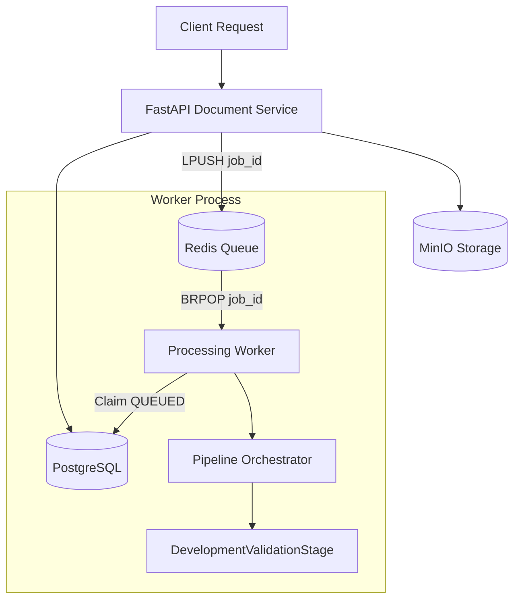

# Backend Phase 3: Processing Orchestration

This phase establishes the foundational job processing and queuing architecture for the Bhu-Lekh platform, adhering strictly to the zero-mandatory-cost constraint. It implements robust, idempotent task orchestration using PostgreSQL and Redis, without executing real AI or OCR models.

## Architecture

## 1. Job Lifecycle & State Transitions

The system utilizes an authoritative `ProcessingJob` state machine stored in PostgreSQL, preventing multiple workers from executing the same job concurrently or invalid status jumps.

**Valid Transitions:**
- `PENDING` → `QUEUED`: Enqueued successfully in Redis.
- `PENDING` → `FAILED`: Failed to enqueue to Redis.
- `QUEUED` → `PROCESSING`: Claimed by a worker.
- `PROCESSING` → `COMPLETED`: Pipeline executed successfully.
- `PROCESSING` → `FAILED`: Unrecoverable error or max retries exceeded.
- `PROCESSING` → `QUEUED`: Recoverable error and `retry_count < MAX_RETRIES`.

## 2. Queue Architecture

We leverage the existing `redis` infrastructure.
- **Queue System**: A simple lightweight Redis list.
- **Push**: `LPUSH bhulekh:processing_jobs {"job_id": "..."}`
- **Pop**: `BRPOP bhulekh:processing_jobs`
- **Data Payload**: We explicitly avoid putting document binaries or massive metadata payloads into Redis. Only the `job_id` string is sent.

## 3. Worker Architecture

The worker is a standalone long-running Python process (`app.workers.run_worker`).
- **Claiming**: It pops a `job_id` and uses `SELECT ... FOR UPDATE SKIP LOCKED` inside an atomic transaction to ensure it is in a `QUEUED` state and claims it by moving it to `PROCESSING`.
- **Idempotency**: Duplicate queue messages for the same `job_id` are safely discarded if another worker already moved it out of `QUEUED`.
- **Execution**: The pipeline Orchestrator runs the job's defined processing stages sequentially.
- **Docker Integration**: Runs identically inside the `bhulekh_worker` container.

## 4. Pipeline Abstraction

The `ProcessingOrchestrator` runs an ordered list of `ProcessingStage` instances.
- For Phase 3, only `DevelopmentValidationStage` is implemented.
- The pipeline architecture tracks durations for each stage and pushes JSON results directly into `ProcessingJob.job_metadata`.
- Future stages (e.g., OCR, Data Extraction, GIS Validation) simply need to extend `ProcessingStage` and be appended to the worker's orchestration list.

## 5. Idempotency & Concurrency

- **Idempotency**: Checked at the database layer. If a job is re-enqueued manually via API while it is `PROCESSING` or `COMPLETED`, the worker correctly ignores it because it won't be `QUEUED`.
- **Concurrency**: Guaranteed via PostgreSQL row-level locks. Two workers processing the exact same queue message simultaneously will hit the atomic `FOR UPDATE` lock; only one will succeed in the `QUEUED -> PROCESSING` transition.

## 6. Failure & Retries

- **Controlled/Uncontrolled Exceptions**: Caught by the Orchestrator. The transaction rolls back partial database artifacts securely.
- **Retries**: Configurable `MAX_RETRIES` (currently 3).
- **Stale Jobs**: If a worker crashes mid-`PROCESSING`, the job may become permanently `PROCESSING` until a future stale-job recovery sweep (scheduled for a later infrastructure hardening phase) returns it to `QUEUED`.

## 7. API Endpoints

- **`GET /api/v1/documents/{document_id}/processing`**: Exposes updated metadata including `worker_id`, `retry_count`, `job_metadata`, and `queued_at`.
- **`POST /api/v1/documents/{document_id}/process`**: Safely allows an operator to manually trigger or re-trigger orchestration for a stalled or failed document. Rejects conflicts if already queued or processing.

## Known Limitations & Phase 4 Preparation

- OCR is currently a placeholder sleeping for 2 seconds.
- Stale Job sweeping (recovering jobs stuck in `PROCESSING` after a worker kernel panic) is deferred to future CRON phases.
- Authentication/RBAC over manual trigger endpoints is deferred.

Phase 4 will introduce real OCR capabilities, structured text extraction, Confidence Score assignment, and PostGIS verification.
