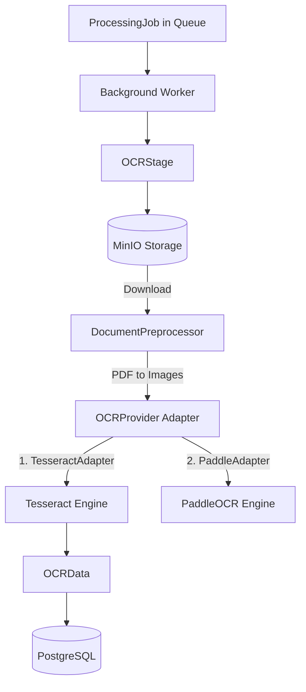

# Backend Phase 4: Document Preprocessing & OCR

This document outlines the architecture and implementation of the OCR processing pipeline in the Bhu-Lekh backend system.

## Overview

The OCR system takes a raw uploaded document (PDF or image) from MinIO, preprocesses it into normalized images, and extracts text and bounding box information using an OCR engine. It is designed around a zero-mandatory-cost constraint, utilizing local open-source models rather than paid cloud APIs.

## Architecture

The system uses an Adapter pattern (`OCRProvider`) to allow seamless switching between different OCR engines.

### Models

The OCR results are stored in PostgreSQL using three hierarchical tables:
1. **`ocr_document_results`**: Tracks overall status, provider used, and language configuration.
2. **`ocr_page_results`**: Stores the raw text and confidence score for a specific page.
3. **`ocr_blocks`**: Stores the precise bounding boxes (`x1`, `y1`, `x2`, `y2`), confidence, and individual text tokens for spatial highlighting on the frontend.

## Components

### Document Preprocessor
Handles converting multi-page PDFs into PIL images using `pdf2image` and `poppler`. It also uses OpenCV (`cv2.fastNlMeansDenoising`) to normalize image contrast and remove noise, preparing it for maximum OCR accuracy.

### OCR Adapters
Currently, the system uses the `TesseractAdapter` by default. This uses the local `tesseract-ocr` system package. It extracts both raw text (`image_to_string`) and TSV bounding box data (`image_to_data`).

An interface `OCRProvider` is defined so that `PaddleOCRAdapter` can be implemented in the future if better accuracy is needed for specific Indian languages, without changing the Orchestrator pipeline.

### OCRStage
Integrates into the `ProcessingOrchestrator`. It fetches the document, loops through the pages, runs preprocessing and OCR, and handles database persistence and error boundaries.

## APIs

The following inspection endpoints are exposed (Read-Only):
- `GET /api/v1/documents/{document_id}/ocr`: Returns the document status and a list of processed pages.
- `GET /api/v1/documents/{document_id}/ocr/pages/{page_number}`: Returns the detailed bounding blocks for a specific page.

## Testing
Integration tests ensure that:
1. The Tesseract engine is accessible in the environment.
2. An image yields valid `OCRPageResultData`.
3. The API properly serializes and returns the database models.
