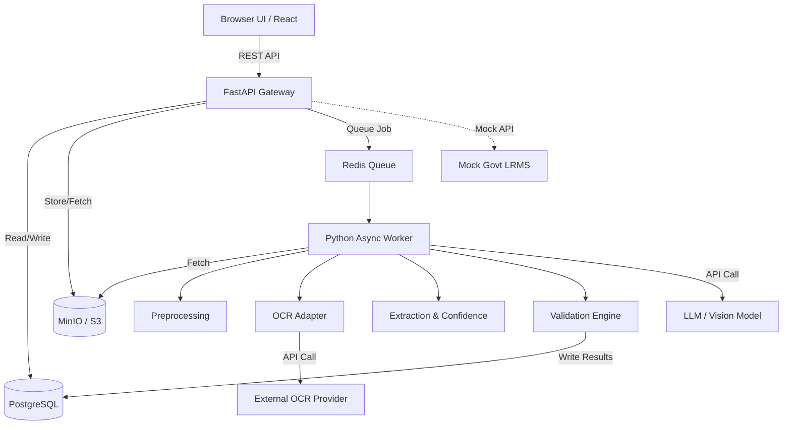

# System Architecture

## Architecture Overview
The system follows a Modular Monolith architecture, supported by asynchronous background workers for document processing, to balance rapid hackathon development with production-oriented scalability.

### Technology Stack
- **Frontend**: React, TypeScript, Vite, Tailwind CSS
- **Backend API**: Python, FastAPI, Pydantic, SQLAlchemy
- **Database**: PostgreSQL (PostGIS optional for future GIS)
- **Object Storage**: MinIO (S3-compatible)
- **Background Queue**: Redis + Celery/RQ (or FastAPI BackgroundTasks for MVP)
- **AI/OCR**: Provider Abstraction Layer (Tesseract / Cloud Vision / VLM)

## Mermaid Architecture Diagram

## Core Principles
1. **Stateless API**: FastAPI layer remains stateless; all state is in DB/MinIO.
2. **Decoupled AI**: OCR and Extraction rely on generic interface contracts, allowing swap-out of underlying models.
3. **Immutability**: Original files are read-only in MinIO. Extractions are appended, not overwritten.
4. **Adapter Pattern**: Government systems are mocked via defined adapters, ready for real endpoints.
